# Themes for prifly

Ten colour themes for prifly, two fonts, and one skin. Every theme passes
prifly's own theme check without a single note: nothing is reverted and
nothing is flagged.

| Theme | Modes | Character |
|---|---|---|
| **High Contrast** | light, dark | Black on white and white on black. Every word is at 7:1 or better (WCAG AAA), hairlines are solid, and the focus ring is magenta by day and yellow by night |
| **Daylight** | light | Warm cream paper, deep sepia ink and one burnt-sienna accent |
| **Calm** | light, dark | Slate grey-blue with a quiet accent. State colours are desaturated but still readable |
| **Solarized** | light, dark | Ethan Schoonover's palette. Text and coloured words are stepped up to readable contrast |
| **Terminal** | dark | Phosphor green on near-black, set in JetBrains Mono. States use amber, red and cyan |
| **Game Boy** | light | The four DMG greens, set in Pixelify Sans. States keep prifly's hues, darkened for the green screen |
| **Brutalist** | light | Neo-brutalism: flat lemon, sky and pink blocks with pure black ink, thick black frames, hard shadows and square corners |
| **IDE Classic** | light, dark | Inspired by JetBrains' IntelliJ Light and Darcula |
| **Code Modern** | light, dark | Inspired by VS Code's Light Modern and Dark Modern |
| **Studio** | light, dark | Inspired by Adobe Photoshop: its Dark and Lightest interface greys, with the Spectrum accent blue and state colours |

JetBrains, IntelliJ, Darcula, VS Code, Adobe, Photoshop and Spectrum are their owners' names. These
themes only borrow the colours, so they have names of their own.

## Screenshots

These are prifly's fixture preview with each theme applied, made with the
same stylesheet code the window uses.

| | |
|---|---|
| 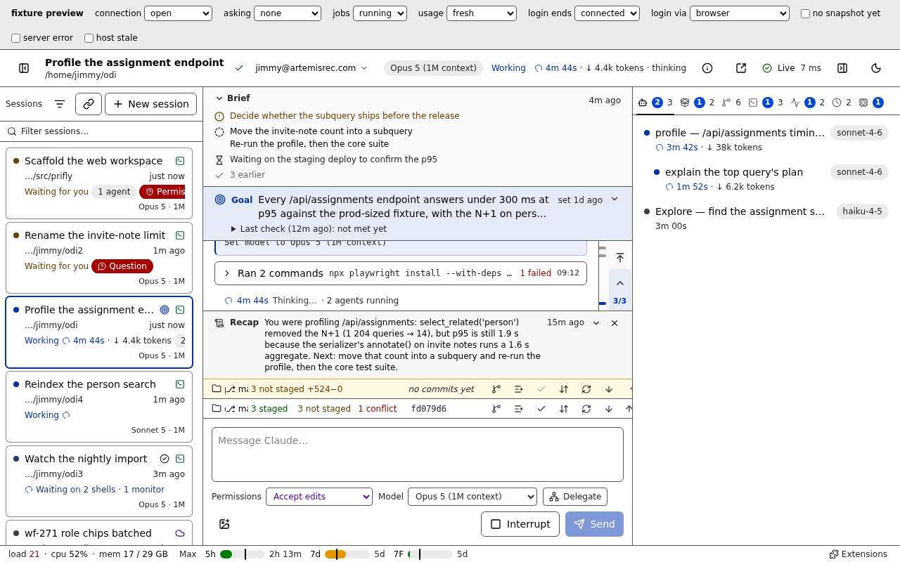 | 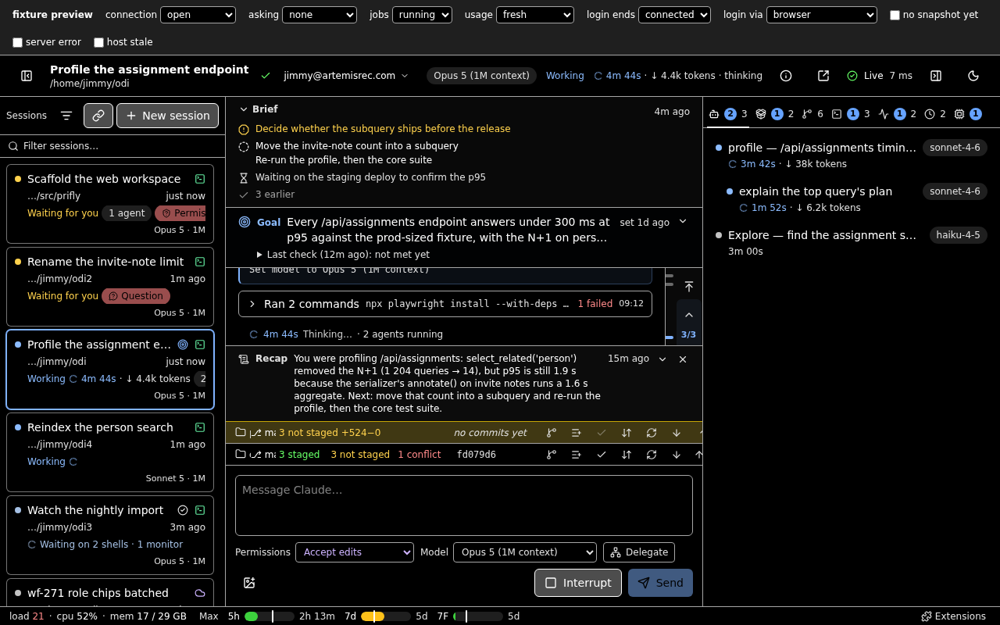 |
| 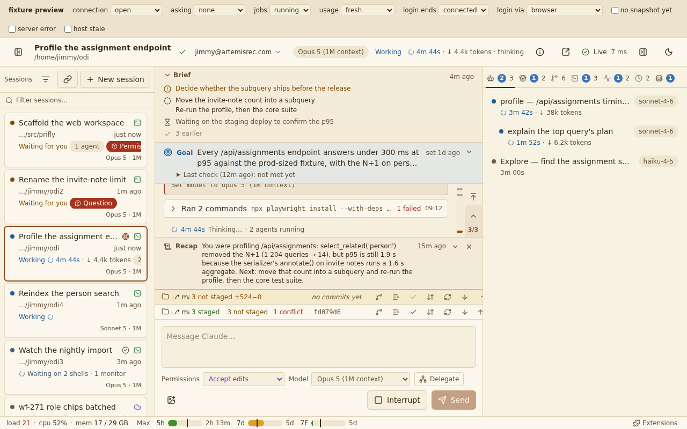 | 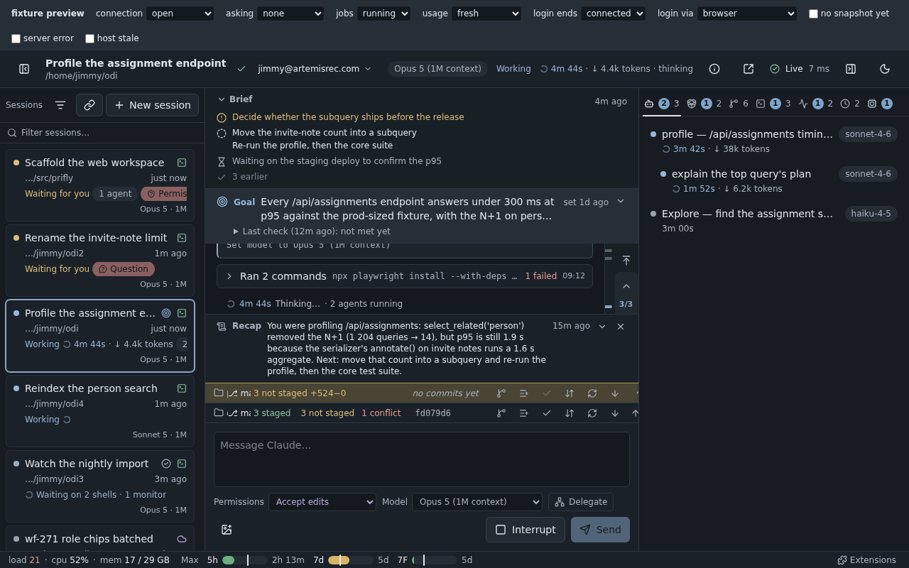 |
| 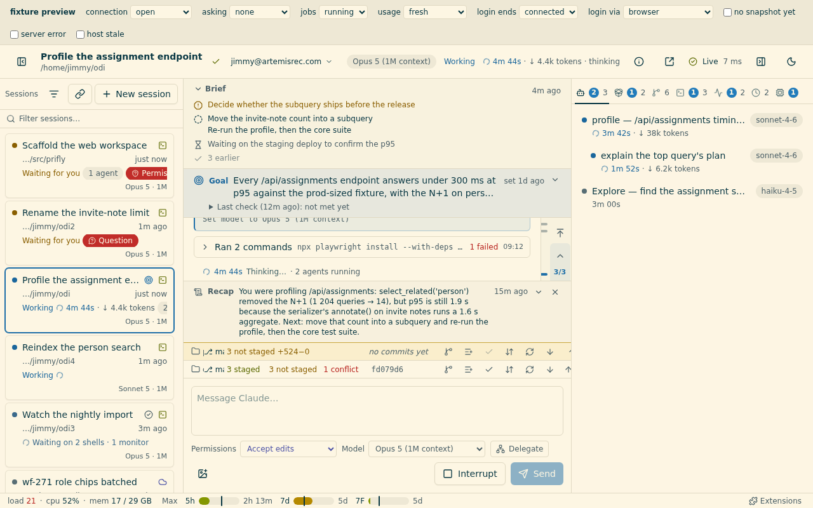 | 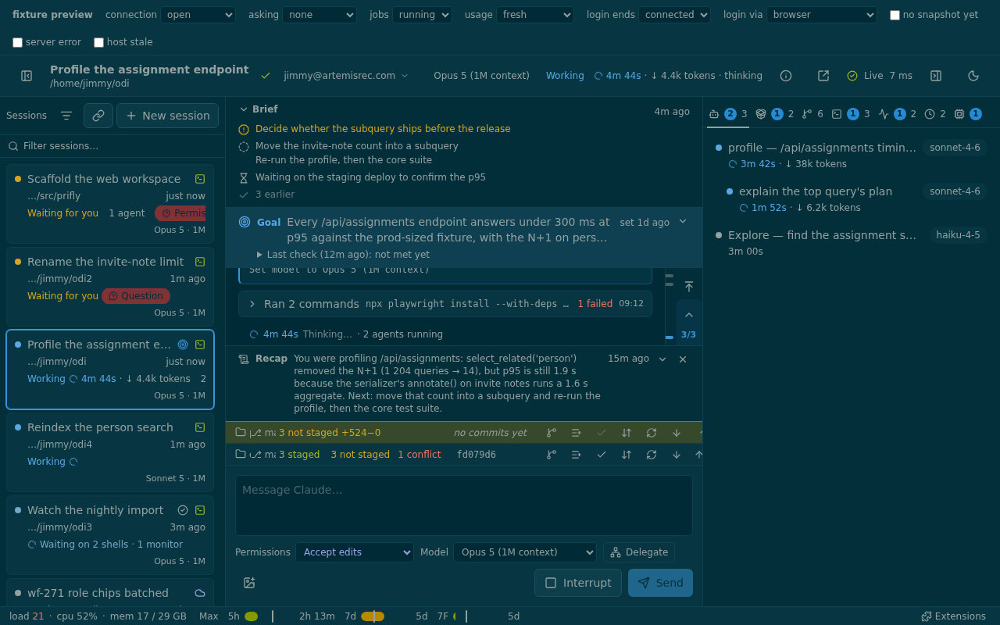 |
| 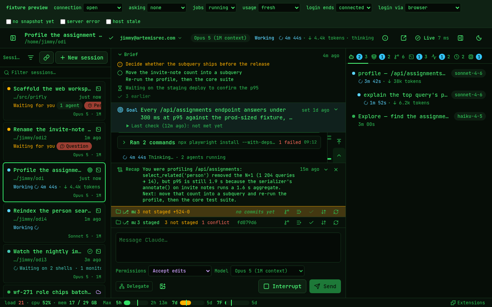 | 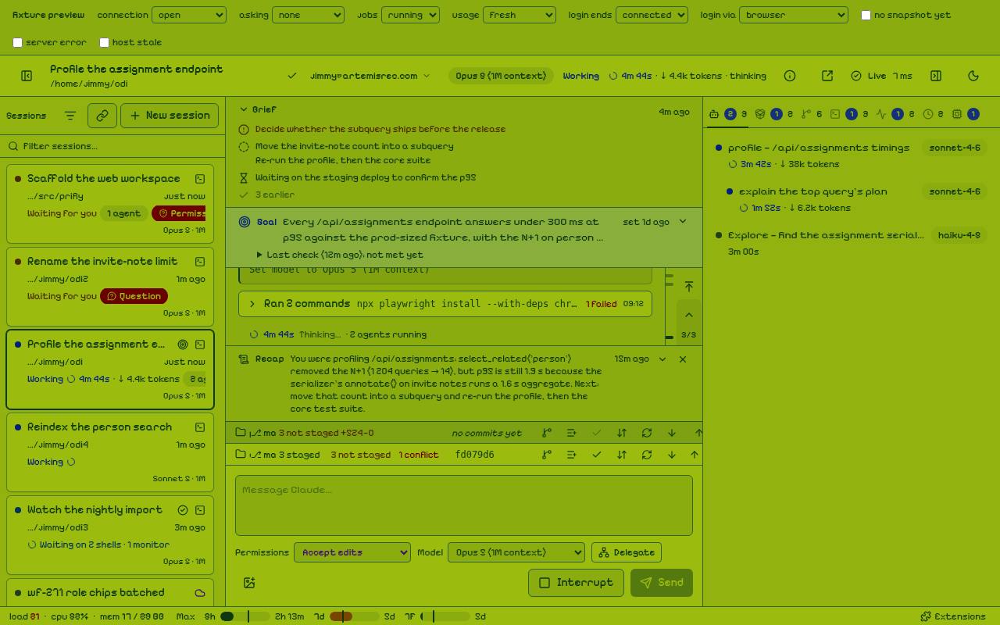 |
| 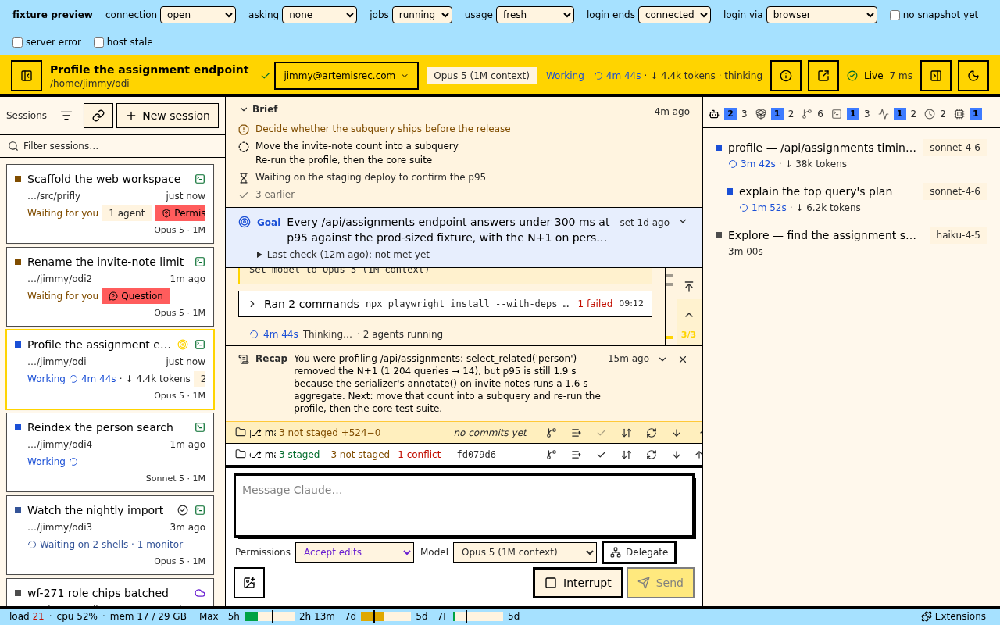 | 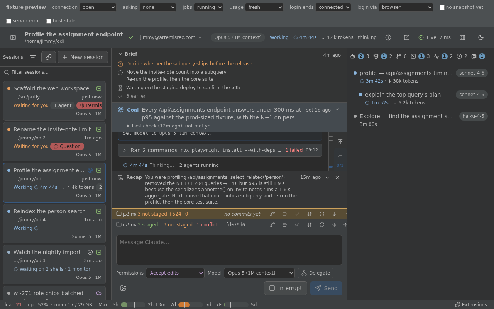 |
| 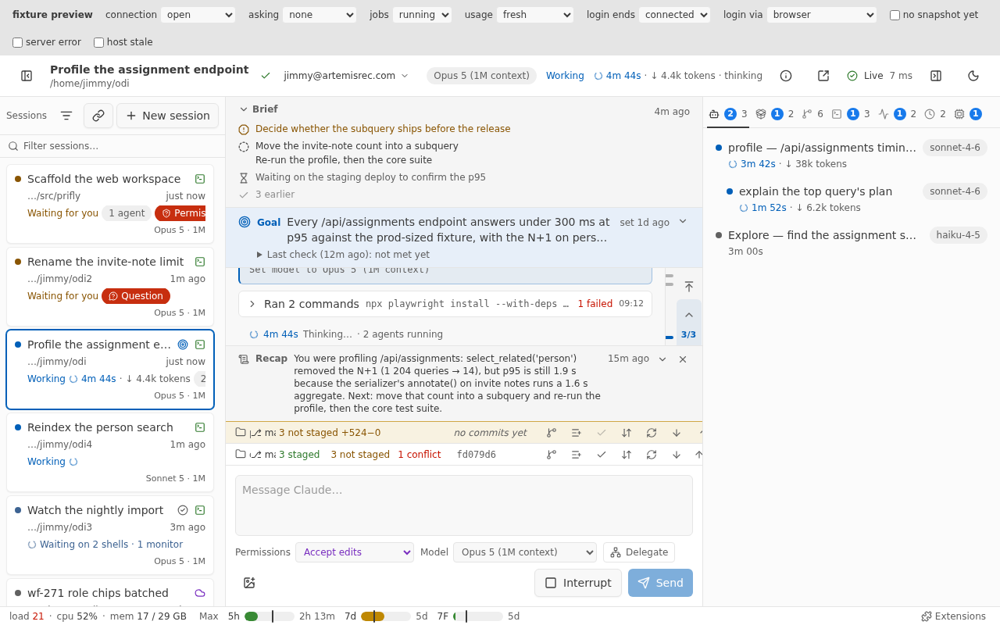 | 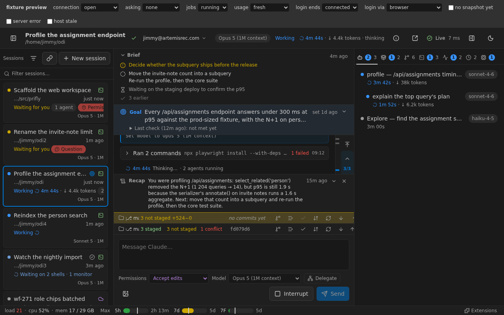 |

## Install

prifly loads extensions from `~/.local/share/prifly/extensions`.

```sh
# Once: put the repo on GitHub, private.
cd ~/src/prifly-ext-themes
gh repo create prifly-ext-themes --private --source . --push

# Then install it where prifly looks.
git clone git@github.com:<you>/prifly-ext-themes.git \
  ~/.local/share/prifly/extensions/prifly-ext-themes
```

1. In prifly, open **Extensions** from the status bar and enable **Themes**.
2. Press **Ctrl+K**, choose **Switch theme…** and move through the list. Each
   theme is previewed as you go, and Enter keeps the one you are on.
3. Terminal and Game Boy come with a font. **Ctrl+K → Switch font…** replaces
   it without changing the colours.

To update later, run `git pull` in the installed folder.

## Fonts and licences

| Font | Used by | Licence |
|---|---|---|
| JetBrains Mono (variable, 100–800) | Terminal, for both text and code | SIL OFL 1.1, `fonts/jetbrains-mono/OFL.txt` |
| Pixelify Sans (variable, 400–700) | Game Boy, for text only. Code stays in prifly's monospace | SIL OFL 1.1, `fonts/pixelify-sans/OFL.txt` |

Both files are the unmodified variable TTFs from the Google Fonts repository.

Game Boy's pixel font is for text only. prifly has two font tokens, one for
text and one for code, and no separate token for headings. So the choice was
between pixels everywhere and no pixel font. Pixelify Sans is a pixel face
drawn to stay readable at text sizes, which Press Start 2P is not, so it is
used for all the text. Code stays in a real monospace.

## The Brutalist skin

A theme can only set colours. The frames, shadows and square corners are in
`skin/brutalist.css`, which prifly loads for as long as this extension is
enabled, whichever theme you pick. So the whole sheet sits inside one CSS
style query:

```css
@container style(--backdrop: #010101) and style(--viz-grid: #000000) { … }
```

Only the Brutalist theme sets those two values, so under any other theme the
skin does nothing. It follows prifly's rules for skins that must stack:

- It styles `[data-part]` regions only.
- It reads tokens and never sets one. `--radius` is not a theme token, so
  the corners are squared with `border-radius` instead.
- It has no `!important` and no literal colours.
- Every frame is a box-shadow, so nothing moves.

Style queries on custom properties need Chromium 111+ (WebView2 on Windows)
or Safari 18+.

## Changing a colour

The palettes live in `src/themes/*.ts`, one file per theme, with comments.
`prifly-extension.json` is generated from them:

```sh
bun run build     # rewrite prifly-extension.json
bun run report    # prifly's check for every theme; `bun run report calm` adds a contrast table
bun test          # everything below
```

The model swatches (`model-*`) and the pie colours (`viz-series-*`) are not
written in the palettes: `src/model-colours.ts` and `src/series-colours.ts`
derive them from each theme's own states, so a recoloured state recolours them.

The test imports prifly's own checker and manifest reader from a prifly
checkout. That is `~/src/prifly` by default; set `PRIFLY_REPO` to use another.
It asserts that:

- the manifest matches the palettes;
- prifly reads every theme, font and the skin;
- every theme has the modes it promises;
- the host has no warnings for any theme;
- every mode sets all 61 tokens and passes `validateTheme` with no notes;
- every mode's eight pie colours are 3:1 against the card and background and at least 0.08 apart in OKLab, and the label on a slice is 4.5:1 against all of them;
- High Contrast has 7:1 text and a focus ring at 4.5:1 or better on every surface;
- the skin is keyed to Brutalist's signature only and stays stackable.
